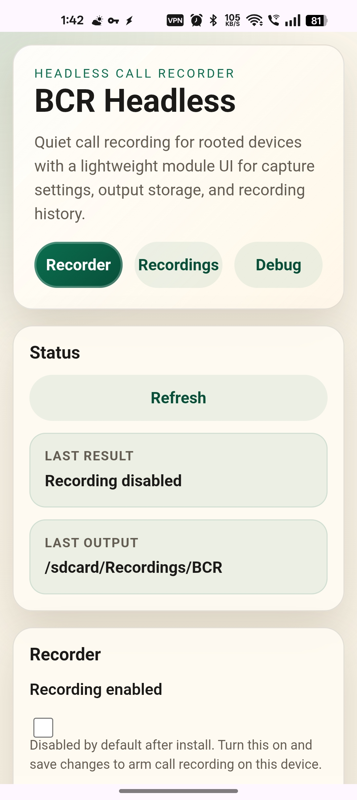
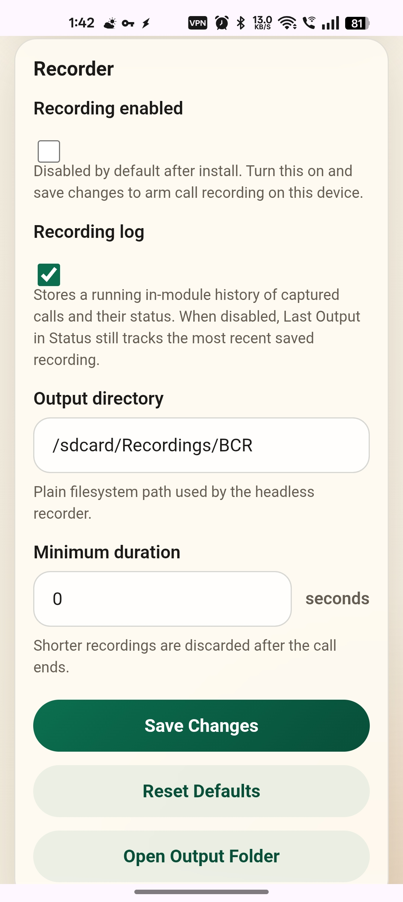

# BCR Headless


[](https://github.com/wjdob/BCR-Headless/releases/latest)
[](./LICENSE)

BCR Headless is a headless call recorder module for rooted Android devices. It is an architectural rebuild of the original BCR project that keeps the recorder inside the module directory, exposes configuration through a module WebUI, and avoids installing a visible companion app.

 

## Credits

This project is based on the original BCR project by Andrew Gunnerson (`chenxiaolong`) and its contributors:

* Original project: https://github.com/chenxiaolong/BCR
* Original author: Andrew Gunnerson
* Original contributors: see the upstream repository history and contributors list

## What Changed

The original BCR relied on a system app and privileged Android components. This rebuild pivots to a different architecture:

* No visible Android settings app is installed
* The helper APK is stored inside the module under `tools/bcr-headless.apk`
* `skip_mount` avoids creating a `/system` overlay footprint
* Configuration lives in module-local files and mirrors into KernelSU module config when available
* A module WebUI is the primary configuration surface for KernelSU and standalone KSUWebUI-compatible apps

This design exists to reduce the user-space surface that security-sensitive apps can inspect easily while still keeping call recording functional.

## Current Features

* Headless boot-time recorder daemon
* Works as a Magisk or KernelSU module
* WebUI implementation
* Enable or disable recording from the WebUI
* Configure output directory
* Configure minimum recording duration
* Optional in-module recording log with a dedicated WebUI view
* Best-effort "Open output folder" action from the WebUI
* Open individual recordings from the recorded-calls view
* Separate debug view for runtime status, probe output, and logs
* Recording files saved directly to a plain filesystem path

## Current Limitations

This rebuild is intentionally narrower than the original BCR app:

* Output is currently WAV/PCM only
* The output path is a plain filesystem path, not a SAF tree. Don't ask for enhancement.
* Auto-record rules are not ported
* Contacts integration is not ported
* Best-effort phone-number resolution for filenames and recording-log entries. Tested OK but YMMV.
* Filename templates are not ported
* The current working monitor prefers polling on ROMs where framework callbacks are unavailable
* Debug/runtime details are module-local and do not try to recreate every original app workflow

## Usage

1. Build or download the release zip.
2. Flash it as a Magisk or KernelSU module.
3. Reboot.
4. Open the module WebUI.
5. Configure:
   * `Recording enabled`
   * `Output directory`
   * `Minimum duration`
   * `Recording log` if desired
6. Save changes.

For Magisk installs, the same module can be opened from a standalone KSUWebUI-compatible app.

## WebUI Notes

The main recorder screen is intended for normal use:

* Save changes
* Reset defaults
* Toggle recording
* Open the output folder

The recordings screen is intended for review of captured recordings:

* View captured call recordings
* View call recording capture status
* Open the recordings
* Clear recording log

The debug screen is intended for troubleshooting:

* Refresh runtime state
* Restart the daemon
* Run a probe
* Show daemon logs

## Shell Control

The module can also be controlled directly:

```bash
su -c sh /data/adb/modules/bcr.headless/action.sh status
su -c sh /data/adb/modules/bcr.headless/action.sh config list
su -c sh /data/adb/modules/bcr.headless/action.sh reset-config
su -c sh /data/adb/modules/bcr.headless/action.sh restart
su -c sh /data/adb/modules/bcr.headless/action.sh probe
su -c sh /data/adb/modules/bcr.headless/action.sh logs
```

## Configuration Keys

The main module config keys are:

* `recording.enabled`
* `output.dir`
* `recording.min_duration`
* `recording.log_enabled`

## Versioning

This rebuild uses its own version line and does not inherit the original BCR release numbering. The current build metadata uses:

* `1.x` for the standalone headless rebuild line
* plain semantic version names such as `1.0.0`

## Building

Build the release module zip with:

```bash
./gradlew zipRelease
```

Optional Gradle properties:

* `-PprojectUrl=https://github.com/<you>/<repo>`
* `-PreleaseMetadataBranch=main`

The output zip is written to `app/build/distributions/release/`.

## Publishing Notes

If you publish this project, keep explicit upstream credit to the original BCR project and preserve the GPL license and copyright notices.

Because this repository now differs substantially from the original BCR app architecture due to running in a headless mode without a helper app, this is considered a standalone project.

## License

This project remains GPLv3. See [`LICENSE`](./LICENSE).
