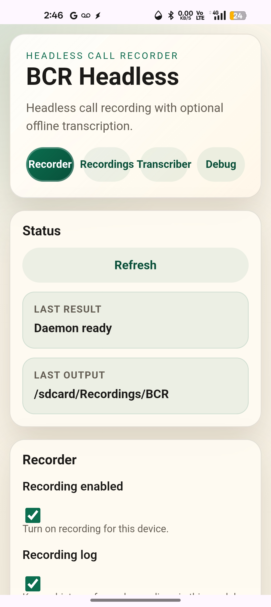
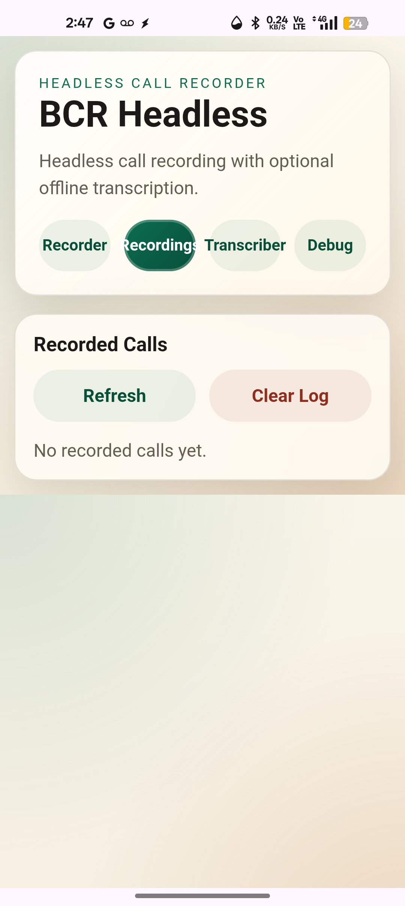
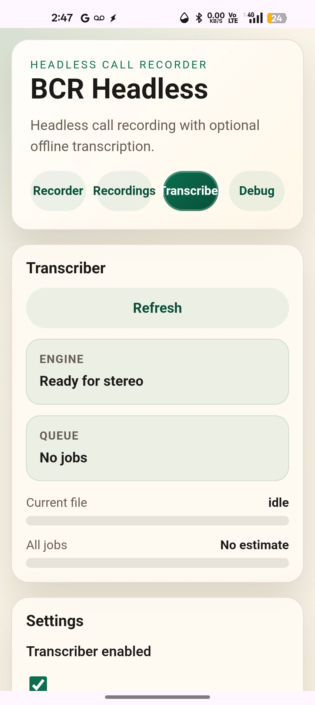
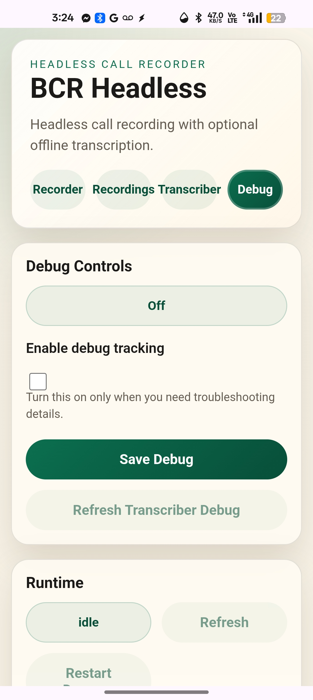
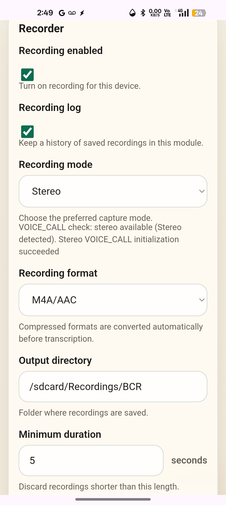
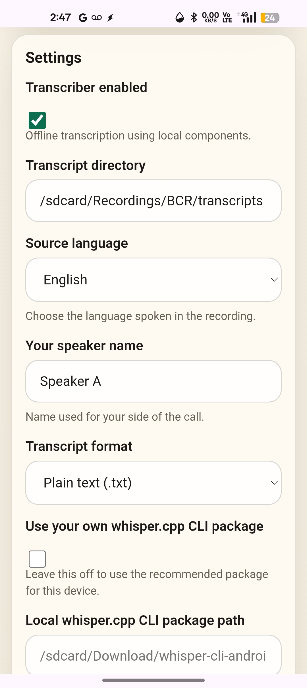
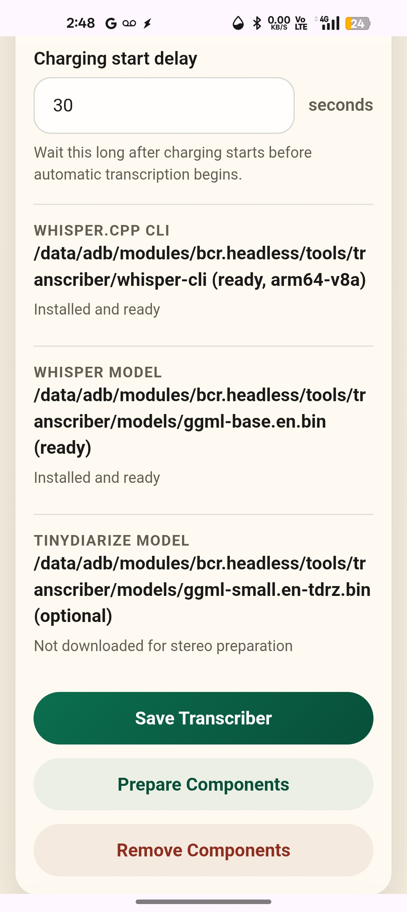
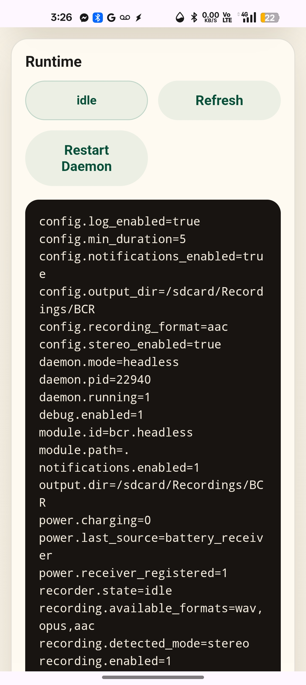
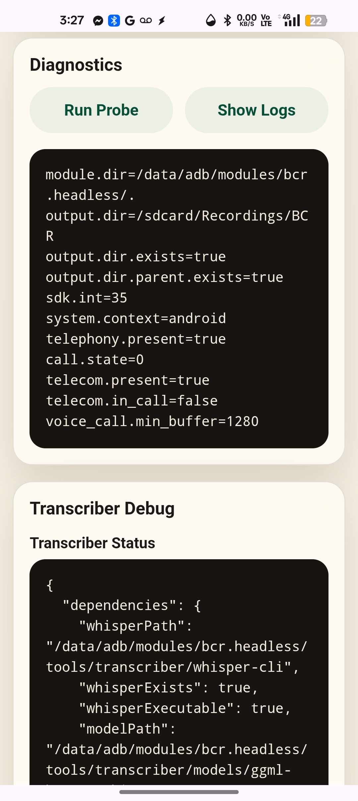

# BCR Headless


[](https://github.com/wjdob/BCR-Headless/releases/latest)
[](./LICENSE)

BCR Headless is a headless call recorder module for rooted Android devices. It
keeps recording, state, and optional offline transcription inside the module
directory and exposes configuration through a module WebUI instead of a visible
companion app.

<p>
  
  
  
  
</p>

## Credits

This project is based on the original BCR project by Andrew Gunnerson
(`chenxiaolong`) and its contributors.

- Original project: https://github.com/chenxiaolong/BCR
- Original author: Andrew Gunnerson
- Original contributors: see the upstream repository history and contributors
  list

## What Changed From The Original App

This rebuild pivots away from the original system-app architecture:

- no visible settings app is installed
- the helper APK lives inside the module under `tools/bcr-headless.apk`
- configuration is stored in module-local files and mirrored into KernelSU
  module config when available
- the module WebUI is the primary control surface
- added optional offline transcriber using Whisper.cpp and Whisper/TinyDiarize models

## Current Features

- headless boot-time recorder daemon
- Magisk and KernelSU module packaging
- recorder enable or disable from WebUI
- output directory selection
- default output directory: `/sdcard/Recordings/BCRHeadless`
- minimum-duration filtering
- recorder output format selection:
  - `WAV/PCM`
  - `OGG/Opus`
  - `M4A/AAC`
- stereo capture by default when `VOICE_CALL` stereo initialization succeeds
- manual `Mono fallback` override in the WebUI
- optional in-module recording history
- offline transcription queue with `.txt` and `.docx` output
- custom self-speaker label in transcripts
- stereo component preparation or mono-fallback Whisper components preparation
- automatic normalization of compressed recordings to PCM WAV before whisper
  transcription so diarization stays on the same stable pipeline
- manual queue management for transcription jobs
- (QoL) update installs preserve config, recorder history, queue state, and downloaded
  transcriber components
- debug view for recorder runtime, transcriber state, component status, and logs

## Current Limitations

- transcription remains experimental
- speaker labeling is best-effort
- mono speaker labeling requires a TinyDiarize-capable model
- stereo diarization is optimized for the common two-side call case
- multiple different people speaking on the same side/channel are not fully
  separated yet
- auto-record rules, contacts integration, and filename-template workflows from
  the original BCR app are not part of this headless rebuild

## Usage

1. Build or download the release zip.
2. Flash it as a Magisk or KernelSU module.
3. Reboot.
4. Open the module WebUI.
5. Save your recorder settings.
6. If you want transcripts, enable the transcriber and run `Prepare Components`.

## WebUI Overview

### Recorder



- enable or disable recording
- choose stereo or mono fallback
- choose the output format
- set the output directory
- set the minimum recording duration

### Recordings


- review saved recording history
- open saved recordings
- clear the module recording history

### Transcriber

<p>



</p>

- enable or disable offline transcription
- choose the transcript directory, source language, and transcript format
- choose the Whisper model and optional overrides
- prepare stereo or mono-fallback components
- queue one, many, or all recordings
- pause, resume, stop, remove, or clear jobs

### Debug

<p>



</p>

- enable troubleshooting data only when needed
- inspect recorder runtime and probe output
- inspect transcriber status, component state, job state, and logs

## Transcriber Component Sets

`Prepare Components` offers two paths:

- `Stereo`: downloads the device-matched `whisper.cpp` CLI package plus the
  selected Whisper model
- `Mono fallback`: downloads the device-matched `whisper.cpp` CLI package plus
  the selected TinyDiarize model

If you choose a compressed recording format such as `OGG/Opus` or `M4A/AAC`,
the transcriber converts the recording to a temporary PCM WAV before sending it
to whisper. This keeps transcription and diarization behavior consistent with
the WAV path.

## Shell Control

```bash
su -c sh /data/adb/modules/bcr.headless/action.sh status
su -c sh /data/adb/modules/bcr.headless/action.sh config list
su -c sh /data/adb/modules/bcr.headless/action.sh reset-config
su -c sh /data/adb/modules/bcr.headless/action.sh restart
su -c sh /data/adb/modules/bcr.headless/action.sh probe
su -c sh /data/adb/modules/bcr.headless/action.sh logs
su -c sh /data/adb/modules/bcr.headless/action.sh transcriber status
su -c sh /data/adb/modules/bcr.headless/action.sh transcriber list
su -c sh /data/adb/modules/bcr.headless/action.sh transcriber enqueue skip /sdcard/Recordings/BCRHeadless/example.wav
```

## Main Configuration Keys

- `recording.enabled`
- `output.dir`
- `recording.min_duration`
- `recording.log_enabled`
- `recording.stereo`
- `recording.format`
- `recording.available_formats`
- `debug.enabled`
- `transcriber.enabled`
- `transcriber.output_dir`
- `transcriber.language`
- `transcriber.speaker_self_name`
- `transcriber.output_format`
- `transcriber.whisper_path`
- `transcriber.model_path`
- `transcriber.tinydiarize_model_path`
- `transcriber.whisper_manifest_url`
- `transcriber.whisper_local_path`
- `transcriber.whisper_url`
- `transcriber.model_url`
- `transcriber.tinydiarize_model_url`

## Transcriber Native Tools

This project uses repo-owned Android `whisper.cpp` builds for the transcriber.
The pinned whisper.cpp source and build matrix live in:

```text
scripts/transcriber-tools.env
```

The `Transcriber tools` workflow publishes:

- `transcriber-tools.env`
- `whisper-cli-android-<abi>.zip`
- `SHA256SUMS`

`Prepare Components` downloads the manifest, chooses the best matching ABI,
verifies the package when checksums are available, and installs the CLI plus the
selected model set.

As an option, you may feed your own Whisper.cpp binaries or Whisper/TinyDiarize model URLs in the Transcriber configuration.

## Versioning

This rebuild uses its own version line and does not inherit the original BCR
release numbering.

- `1.0.0` is the first standalone headless release
- `1.1.2` is the current release

## Building

Build the release module zip with:

```bash
./gradlew zipRelease
```

Optional Gradle properties:

- `-PprojectUrl=https://github.com/<you>/<repo>`
- `-PreleaseMetadataBranch=main`

The output zip is written to `app/build/distributions/release/`.

## License

This project remains GPLv3. See [`LICENSE`](./LICENSE).
