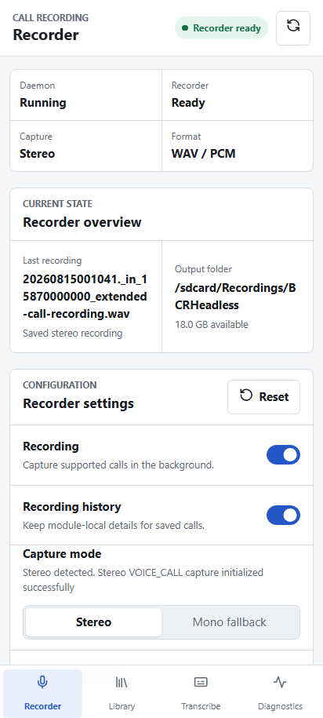
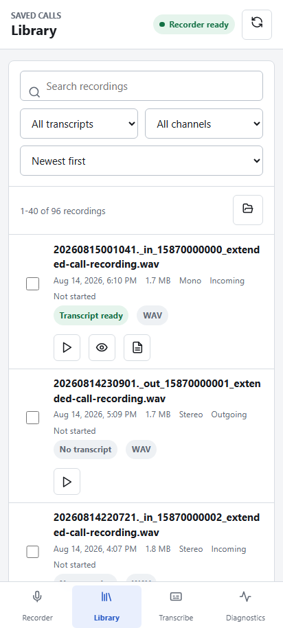
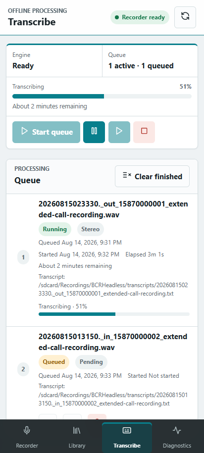
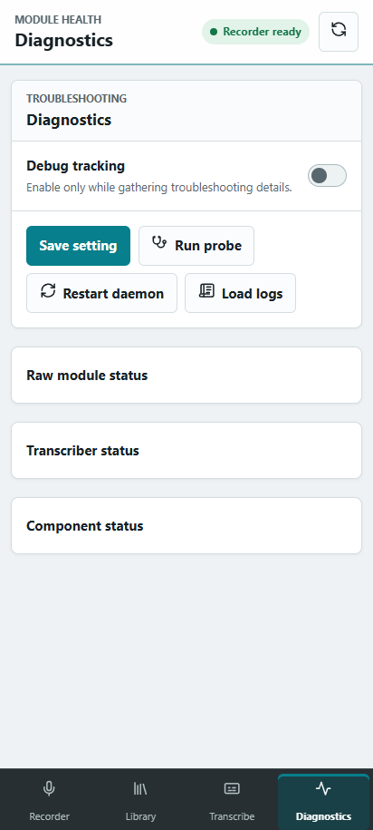

# BCR Headless


[](https://github.com/wjdob/BCR-Headless/releases/latest)
[](./LICENSE)

BCR Headless is a call recorder module for rooted Android devices. Recording,
configuration, diagnostics, and optional offline transcription are managed from
the module WebUI; no visible companion app is installed.

<p>
  
  
  
  
</p>

## Credits

This project is based on the original BCR project by Andrew Gunnerson
(`chenxiaolong`) and its contributors.

- Original project: https://github.com/chenxiaolong/BCR
- Original author: Andrew Gunnerson
- Original contributors: see the upstream repository history and contributors
  list
- Interface icons: [Lucide](https://lucide.dev), distributed under its ISC/MIT
  license terms

## Headless Architecture

This rebuild replaces the original system-app interface with a module-owned
runtime and WebUI:

- the helper APK is installed under `tools/bcr-headless.apk`
- configuration and runtime state are stored inside the module
- KernelSU module configuration is updated when that interface is available
- the WebUI is the primary control surface
- Whisper.cpp transcription is optional and runs entirely on the device

## Features

- headless boot-time recorder daemon
- Magisk and KernelSU module packaging
- stereo `VOICE_CALL` capture when supported, with mono fallback
- `WAV/PCM`, `OGG/Opus`, and `M4A/AAC` recording formats
- configurable output directory and minimum recording duration
- optional module recording history
- compact, searchable, paginated recording library
- persistent multi-selection and transcript availability filters
- manual offline transcription queue with pause, resume, stop, retry, reorder,
  and removal controls
- timestamped `TXT`, `DOCX`, `SRT`, `VTT`, and `JSON` transcripts
- configurable local and remote speaker names
- stereo channel separation and best-effort mono TinyDiarize labeling
- temporary PCM normalization for compressed recordings
- component preparation matched to stereo or mono-fallback operation
- on-demand diagnostics with debug tracking disabled by default
- in-place update preservation for configuration, history, queue state, logs,
  downloaded components, recordings, and transcripts
- atomic transcript publication so interrupted work cannot replace a valid file

## Current Limitations

- transcription and speaker labeling remain experimental
- mono speaker labeling requires a TinyDiarize-capable model
- stereo labeling is optimized for the common two-side call case
- different people sharing one channel may not always be distinguished
- auto-record rules, contacts integration, and filename templates from the
  original BCR app are not part of this headless rebuild

## Installation

1. Build or download the module ZIP.
2. Install it through Magisk or KernelSU.
3. Reboot.
4. Open the module WebUI and review the Recorder settings.
5. To use transcription, enable it and select `Prepare Components`.

The default recording directory is `/sdcard/Recordings/BCRHeadless`. The
default transcript directory is `/sdcard/Recordings/BCRHeadless/transcripts`.
Existing configured paths and user media are preserved during module updates.

## WebUI

### Recorder


The Recorder view presents daemon health, active recording state, detected
capture support, output health, free space, and the latest recording before its
editable settings.

### Library


The Library provides fast server-side search, transcript filtering, sorting,
paging, persistent selection, recording actions, inline queue actions, and
transcript preview.

### Transcribe


Transcription is deliberately manual. Adding recordings does not start the
worker; select `Start Queue` when processing should begin. The active job and
queue show stage, progress, elapsed time, ETA, timestamps, output target, and
recoverable errors. Component details expand only while preparing or
troubleshooting.

### Diagnostics


Diagnostics keeps troubleshooting controls and raw details out of the primary
workflow. Debug tracking is off by default; probe and log output appears only
when requested.

## Transcriber Components

`Prepare Components` offers two sets:

- `Stereo`: the device-matched Whisper.cpp CLI and selected Whisper model
- `Mono fallback`: the device-matched Whisper.cpp CLI and selected
  TinyDiarize-capable model

The repository-owned `Transcriber tools` workflow builds Android CLI packages
for supported ABIs. Its pinned Whisper.cpp source and build matrix are stored in
`scripts/transcriber-tools.env`. Preparation reads the release manifest,
selects the matching package, verifies available checksums, and installs only
the chosen model set. Component sources are curated by the module.

## Shell Control

```bash
su -c sh /data/adb/modules/bcr.headless/action.sh ui-snapshot recorder
su -c sh /data/adb/modules/bcr.headless/action.sh status
su -c sh /data/adb/modules/bcr.headless/action.sh output-health transcripts
su -c sh /data/adb/modules/bcr.headless/action.sh config list
su -c sh /data/adb/modules/bcr.headless/action.sh restart
su -c sh /data/adb/modules/bcr.headless/action.sh probe
su -c sh /data/adb/modules/bcr.headless/action.sh logs
su -c sh /data/adb/modules/bcr.headless/action.sh transcriber status
su -c sh /data/adb/modules/bcr.headless/action.sh transcriber library 0 40 '' all newest all
su -c sh /data/adb/modules/bcr.headless/action.sh transcriber enqueue skip /sdcard/Recordings/BCRHeadless/example.wav
su -c sh /data/adb/modules/bcr.headless/action.sh transcriber start-worker
```

Run the action script without arguments to display the complete command list.

## Main Configuration Keys

- `recording.enabled`
- `output.dir`
- `recording.min_duration`
- `recording.log_enabled`
- `recording.stereo`
- `recording.format`
- `recording.available_formats`
- `debug.enabled`
- `transcriber.enabled`
- `transcriber.output_dir`
- `transcriber.language`
- `transcriber.output_format`
- `transcriber.speaker_self_name`
- `transcriber.speaker_remote_name`
- `transcriber.whisper_path`
- `transcriber.model_path`
- `transcriber.tinydiarize_model_path`
- `transcriber.whisper_manifest_url`
- `transcriber.model_url`
- `transcriber.tinydiarize_model_url`

## Versioning

This rebuild uses its own version line and does not inherit the original BCR
release numbering.

- `1.0.0` is the first standalone headless release
- `1.1.2` is the previous public release
- `1.3.0` is the current public release

## Building And Testing

Use JDK 21 and an Android SDK, then run:

```bash
./gradlew --no-daemon build zipRelease
node scripts/test-webui.mjs
```

Open `app/magisk/webroot/index.html?mock=1` through a local HTTP server to use
the browser mock adapter without a rooted device. The release ZIP is written to
`app/build/distributions/release/`.

Optional Gradle properties:

- `-PprojectUrl=https://github.com/<you>/<repo>`
- `-PreleaseMetadataBranch=main`

## License

This project remains GPLv3. See [`LICENSE`](./LICENSE).
